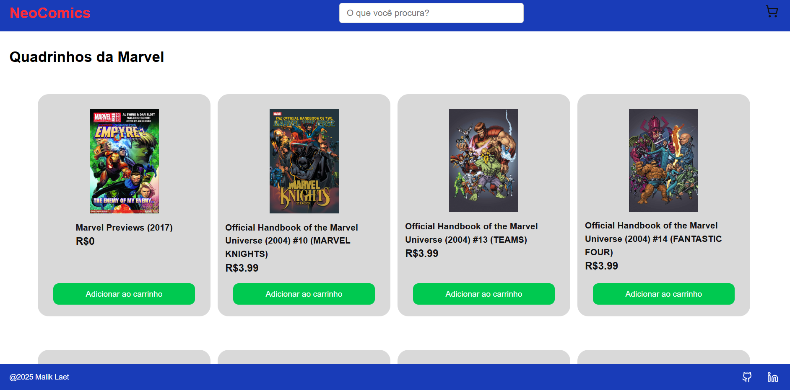
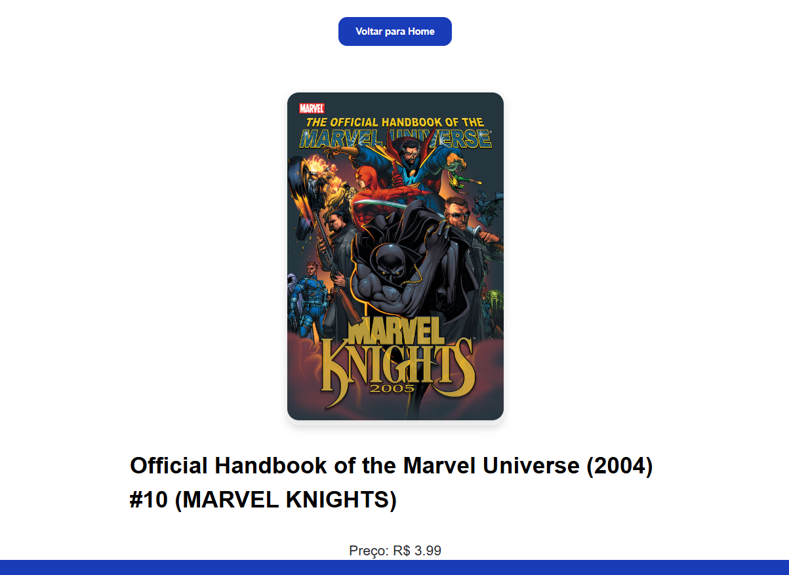

NeoComics
NeoComics é um e-commerce de quadrinhos da Marvel, onde você pode navegar por uma vasta coleção de HQs, ver detalhes dos produtos, fazer buscas, adicionar itens ao carrinho e finalizar sua compra.

Tecnologias Utilizadas
Next.js — Framework React para aplicações SSR/SSG.

React — Biblioteca para construção da interface.

Redux Toolkit — Gerenciamento eficiente de estado do carrinho.

Styled Components — Estilização dinâmica via CSS-in-JS.

TypeScript — Tipagem estática para maior robustez.

Funcionalidades Principais
Listagem de quadrinhos — Visualize vários quadrinhos da Marvel com imagens e preços.

Página de detalhes — Veja informações detalhadas, descrições e avaliações.

Busca dinâmica — Filtre quadrinhos por título em tempo real.

Carrinho de compras — Adicione, remova e altere quantidades de quadrinhos.

Persistência do carrinho — Dados salvos localmente via Redux e localStorage.

Navegação fluida — Uso do Next.js Link para navegação rápida.

Deploy com Docker — Ambiente containerizado para facilitar a implantação.

Demonstração Visual

  	 	

Como rodar o projeto localmente
Clone o repositório:

git clone https://github.com/MalikLaet/neoComics.git
cd neoComics
Instale as dependências:

npm install
Rode o projeto em modo desenvolvimento:

npm run dev
Abra seu navegador em:

http://localhost:3000
Uso com Docker
Para facilitar a implantação e execução, você pode rodar o projeto dentro de um container Docker.

Build da imagem
Na raiz do projeto, rode:

docker build -t neocomics .
Rodar o container

docker run -p 3000:3000 neocomics
Agora o site estará disponível em http://localhost:3000

Exemplo simples de Dockerfile usado no projeto
Dockerfile

# Use uma imagem oficial do Node.js como base
FROM node:18-alpine

# Defina o diretório de trabalho
WORKDIR /app

# Copie os arquivos de package.json e package-lock.json para a imagem
COPY package*.json ./

# Instale as dependências do projeto
RUN npm install

# Copie todos os arquivos do projeto para o container
COPY . .

# Compile o projeto (caso necessário, para produção)
RUN npm run build

# Exponha a porta que o Next.js utiliza
EXPOSE 3000

# Comando para rodar a aplicação
CMD ["npm", "start"]
Scripts disponíveis
npm run dev — Roda o projeto em modo desenvolvimento.

npm run build — Cria a versão de produção.

npm run start — Roda a versão de produção.